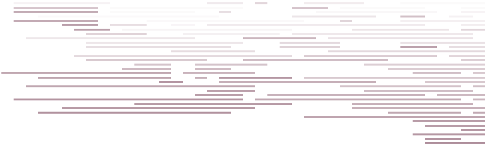

# d3.layout.timeline

Timelines come in all shapes and sizes. One of the most common and popular is the kind that represents the duration of events as bands and tries to efficiently pack them into discrete lanes (sometimes called a swimlane chart). This layout takes an array of data with start and end points and creates the data necessary to draw the data as bands on a timeline.

`npm install d3-layout-timeline`

[Simple example using integers for start and end](http://bl.ocks.org/emeeks/d24171dac80dd535521b)

[Example showing padding, maximum band height and fixed extent](http://bl.ocks.org/emeeks/221c931a1cd8c040d8e7)

[Example with dates](https://gist.github.com/emeeks/280cb0607c68faf30bb5)

[Example with dates, categorized to create parallel semantically meaningful timelines](http://bl.ocks.org/emeeks/3184af35f4937d878ac0)

[Example with hierarchical data](http://bl.ocks.org/emeeks/a666ed4846a7f8bb334d)

**#timeline(data)** Returns an array of objects based on `data` with drawing instructions.

**#timeline.size** Sets or gets an array of [width, height] that is used to calculate the location of the timeline bands along with their start position (`d.start`), y-position (`d.y`) height (`d.dy`) and end (`d.end`). Width can be calculated by subtracting start from end for `svg:rect` elements.

**#timeline.dateFormat** Sets or gets the function that returns the values for the start and end of the bands. Defaults to `function (d) {return new Date(d)}`. The timeline layout can plot floats and ints for relative time (see the simple example that uses integer positions for start and end points).

**#timeline.bandStart** Sets or gets the function that returns the start of the band. Remember that it will also be passed through `#timeline.dateFormat`. Defaults to `function (d) {return d.start}`.

**#timeline.bandEnd** Sets or gets the function that returns the start of the band. Remember that it will also be passed through `#timeline.dateFormat`. Defaults to `function (d) {return d.end}`. If you want to use duration-based notation, you might try something like `function (d) {return d.start + d.duration}`.

**#timeline.extent** Sets or gets extent of the timeline. By default, the extent is set to the minimum start and maximum end, but if you have a range you'd rather set the timeline to, you can do so. This is also passed through `#timeline.dateFormat`.

**#timeline.padding** Sets or gets the distance in pixels between lanes. Defaults to `0`.

**#timeline.maxBandHeight** Sets or gets the maximum band height. Defaults to `Infinity` (bands will fill the given height in the `#timeline.size` array minus any necessary padding).

**#timeline.children** Sets or gets the children accessor, for use with hierarchical timeline data. Typically children are stored in an array in `.children` or `.values`. Set to return null or false to disable hierarchical support. Hierarchical data can be a hierarchical JSON object (like the ubiquitous flare.json dataset) or an array of objects with each having child elements.

If you're looking for a more sophisticated method of visualizing temporal data, you can check out [Topotime](http://dh.stanford.edu/topotime/).